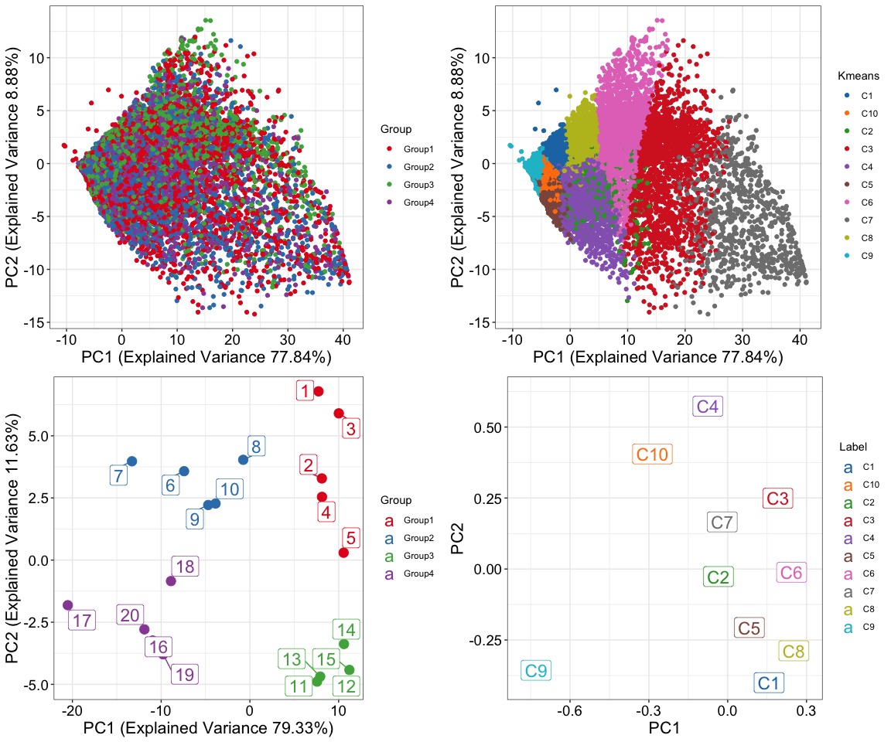
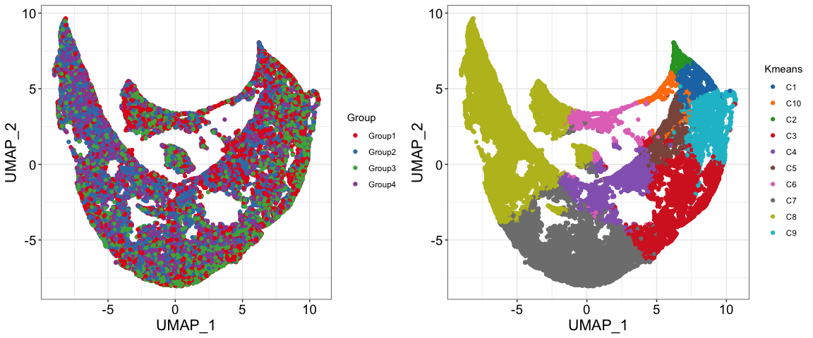
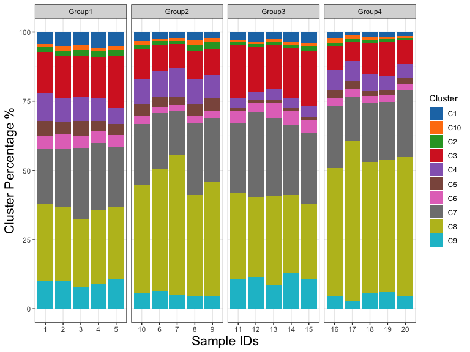
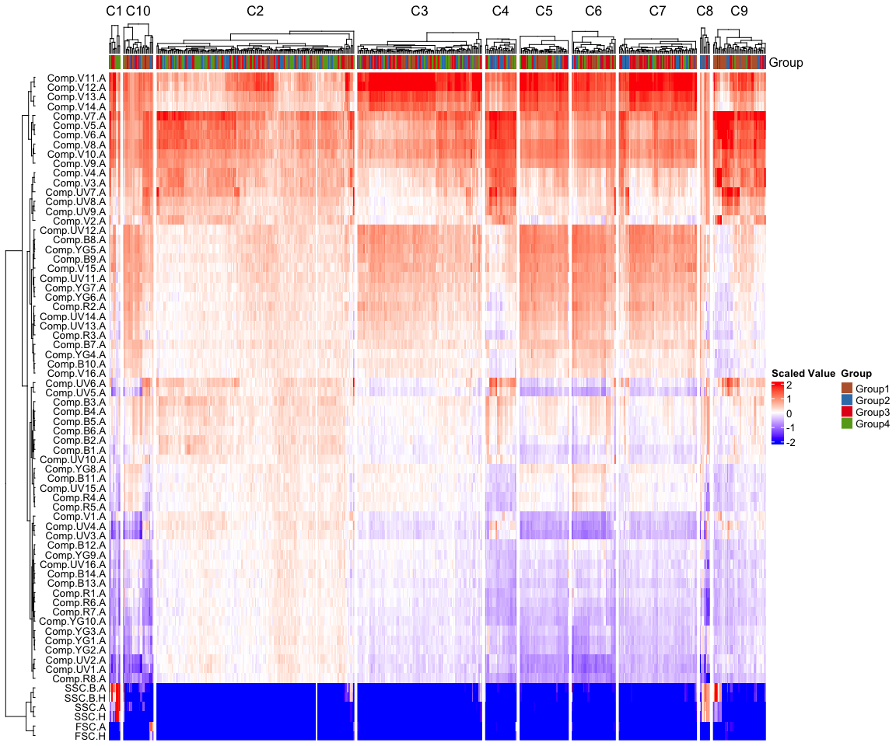

The goal of JoesFlow is to analyze high-dimensional single cell data
from flow cytometry, scRNA-seq, CITE-seq and any kind of single cell
matrix data. JoesFlow utilizes novel scRNA-seq dimension reduction
techniques to generate interpretable and informative visualizations that
incorporate all aspects of a dataset in an unbiased manner.

## JoesFlow Installation

Install locally in RStudio

    remotes::install_github("jcooperdevlin/JoesFlow")

    library(JoesFlow)
    run_app()
    #> Loading required package: shiny
    #> 
    #> Attaching package: 'shiny'
    #> The following objects are masked from 'package:DT':
    #> 
    #>     dataTableOutput, renderDataTable
    #> 
    #> Listening on http://127.0.0.1:6897

## JoesFlow Functions

    sample_data=read.csv("tests/flow_test.csv", sep=',', header=T)
    meta_data=read.csv("tests/metadata.csv", header=T, sep=',')

    datatable(sample_data[1:100,1:20])

    datatable(meta_data)

    cluster_pca(sample_data, meta_data, 10)
    #> Warning: Quick-TRANSfer stage steps exceeded maximum (= 2000000)
    #> Using Freq as value column: use value.var to override.

    cluster_umap(sample_data, meta_data, 10)
    #> Using Freq as value column: use value.var to override.

    composition_plot(sample_data, meta_data, 15)
    #> Warning: Quick-TRANSfer stage steps exceeded maximum (= 2000000)
    #> Using Freq as value column: use value.var to override.

    heat_plot(sample_data, meta_data, 10)

