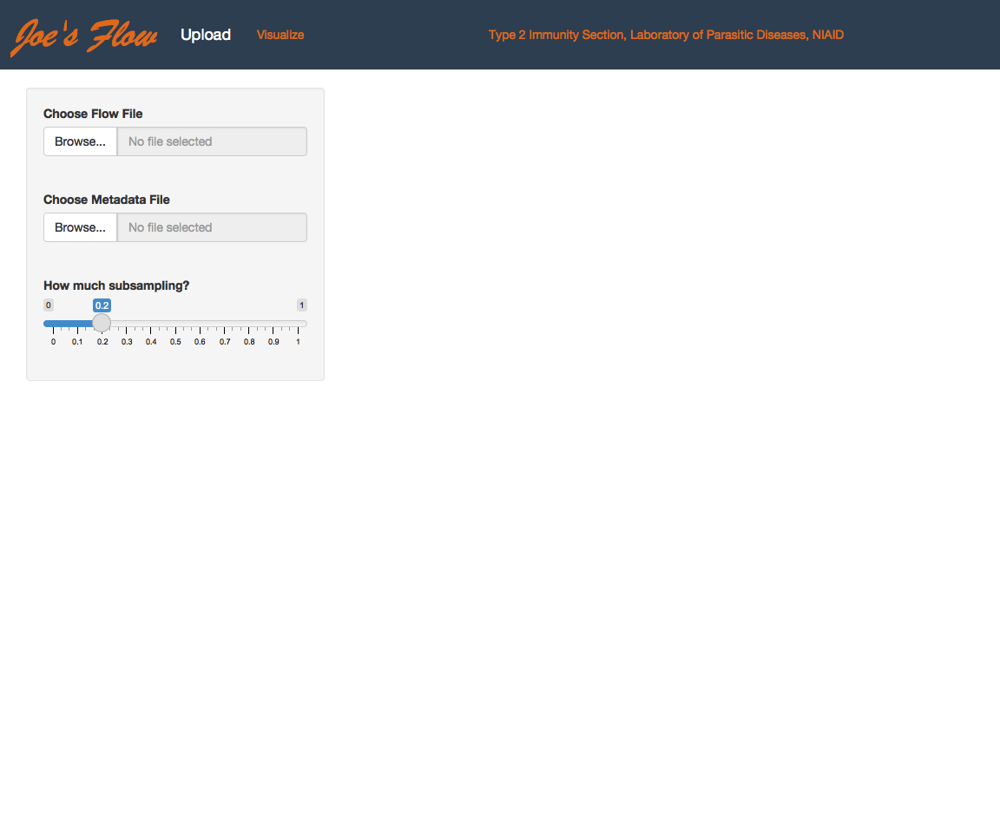
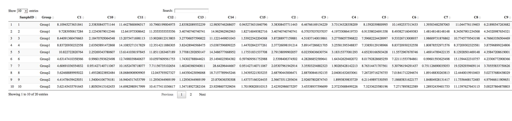

The goal of JoesFlow is to analyze high-dimensional single cell data
from flow cytometry, scRNA-seq, CITE-seq and any kind of single cell
matrix data. JoesFlow utilizes novel scRNA-seq dimension reduction
techniques to generate interpretable and informative visualizations that
incorporate all aspects of a dataset in an unbiased manner.

``` r
library(JoesFlow)
run_app()
#> Loading required package: shiny
#> 
#> Attaching package: 'shiny'
#> The following objects are masked from 'package:DT':
#> 
#>     dataTableOutput, renderDataTable
#> 
#> Listening on http://127.0.0.1:4640
```



JoesFlow Functions
------------------

``` r

sample_data=read.csv("/Users/devlij03/Desktop/JoesFlow/tests/flow_test.csv", sep=',', header=T)
meta_data=read.csv("/Users/devlij03/Desktop/JoesFlow/tests/metadata.csv", header=T, sep=',')

datatable(sample_data[1:100,1:20])
```


``` r

datatable(meta_data)
```


``` r

cluster_pca(sample_data, meta_data, 10)
#> Using Freq as value column: use value.var to override.
```


``` r

cluster_umap(sample_data, meta_data, 10)
#> Using Freq as value column: use value.var to override.
```


``` r

composition_plot(sample_data, meta_data, 15)
#> Warning: Quick-TRANSfer stage steps exceeded maximum (= 2000000)
#> Using Freq as value column: use value.var to override.
```



``` r

heat_plot(sample_data, meta_data, 10)
#> 'magick' package is suggested to install to give better rasterization.
#> 
#> Set `ht_opt$message = FALSE` to turn off this message.
```


